# DH150 - NATHANIELKRAUT

## Nathaniel Asher Kraut - DH 150: User Experience Design

### My UX Project: Redesigning The Marlboro Township (NJ) Public School District Website

After doing a thorough design analysis of two different public school districts websites' I've decided to go with the one that has held more sentimental value to me for the majority of my life. I analyzed both the website for the Marlboro, NJ Public School District, which is in fact my hometown, as well as the website for the Los Angeles Unified School District. My detailed analysis of both of these websites can be found below. 

## Heuristic Evaluation #1 - Marlboro Township Public School District Website 

OVERVIEW 

As a child who grew up in Marlboro, NJ one website that I visited almost every single day was the Marlboro Township Public School website. This website was the center for all things school related from first grade to eighth grade. Anytime teachers would post homework assignments we would find them on this site. Anytime school was potentially closing because of a snow day we would aggresively refresh this website at 4AM in the morning to see if we could go back to sleep. Thus, needless to say, it was and still is imperative that this website have a design that is both gorgeous and user focused at its core. Upon further investigation into my previous school district’s website I found that while they have done quite a redesign since my time there, the design fails in more ways than I could count. With that said, I hope to give the children of Marlboro, NJ the experience they don’t just desserve, but need to accelerate their growth as students and individuals. 

OVERALL EVALUATION

Upon reviewing this website I have found it to be functional as in the actual website works through hard trial and error one could find what they were looking for.  However, the website fails such that actually finding what you’re looking for takes an eternity so overall its design is not user focused. The design does not account for the fact that both parents and students use the website so there is a large gap in the ease of use from the two user personas. On the one hand, students since motivated to check their homework and play around on their devices might be able to overcome the difficulty of use and still find what they are looking for. However, when parents try to use this, especially parents like mine, they’d be at a loss for words and in extreme frustration given the lack of great UX design. That said, I am really looking forward to redesigning this website such to make it easier for all!

SCREENSHOTS OF USER INTERFACE AND DIRECT LINK

https://www.mtps.org

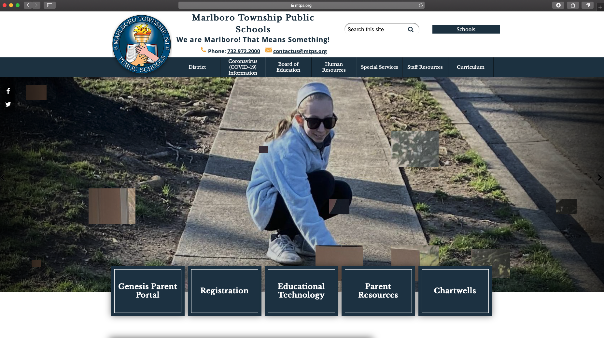 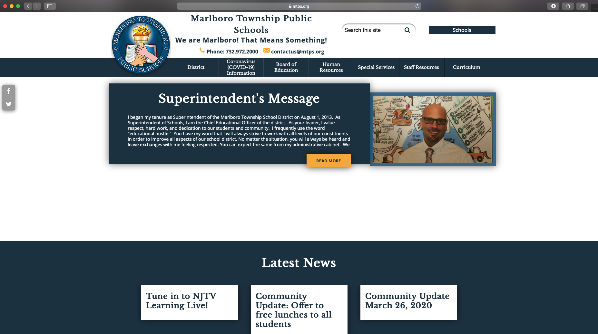 
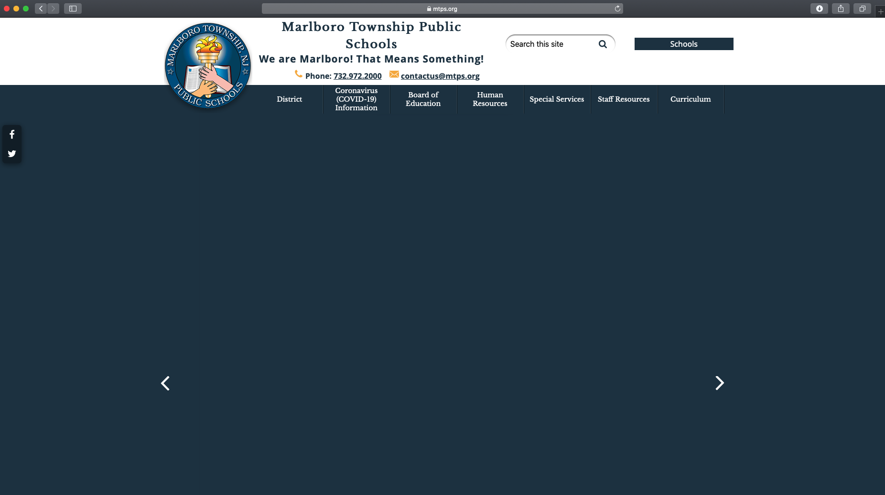 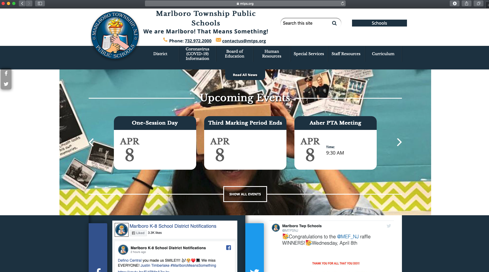
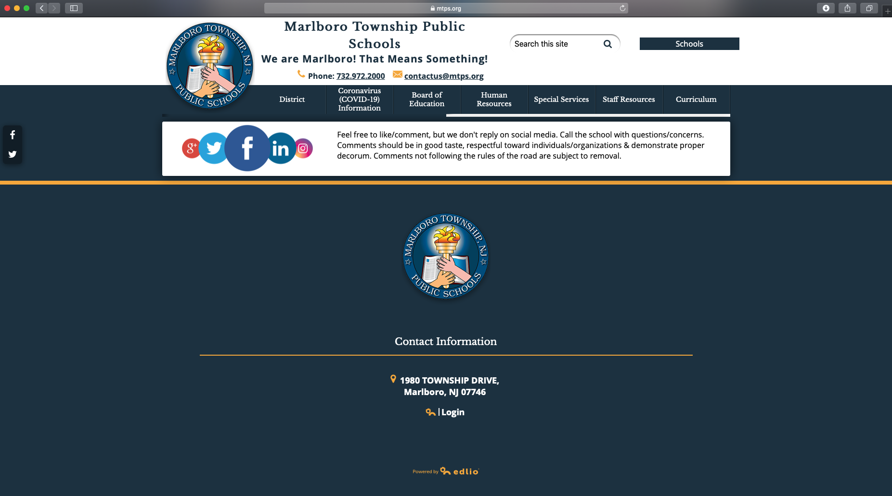

1. Visibility of System Status

This heuristic deals with the idea that the website, mobile application, or product in general should always give the user a look into what is currently happening on the application/website within a reasonable amount of time. Thus, great visibility of system status will allow the user to know where they are in the application in real-time and never leave the user in a state of confusion or limbo. 

The website of choice maintains a poor visibility of system status throughout its use and thus violates this heuristic. If you select an option using the top menu and arrive at the page it does not change its status as shown in the screenshots below. In the example screenshots I expected see to see option I choose highlighted to tell me which page of the website I was on but, instead it remains the same. Simply inverting the colors of the option selected could alleviate this problem allowing users to see into what’s happening and where they are in the website. 

**Severity Rating: 2/3, minor usability issue**

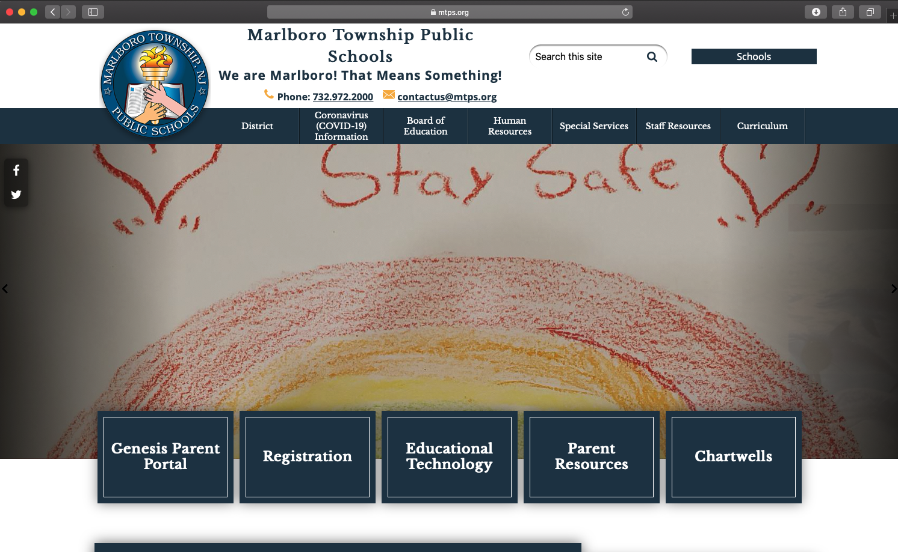 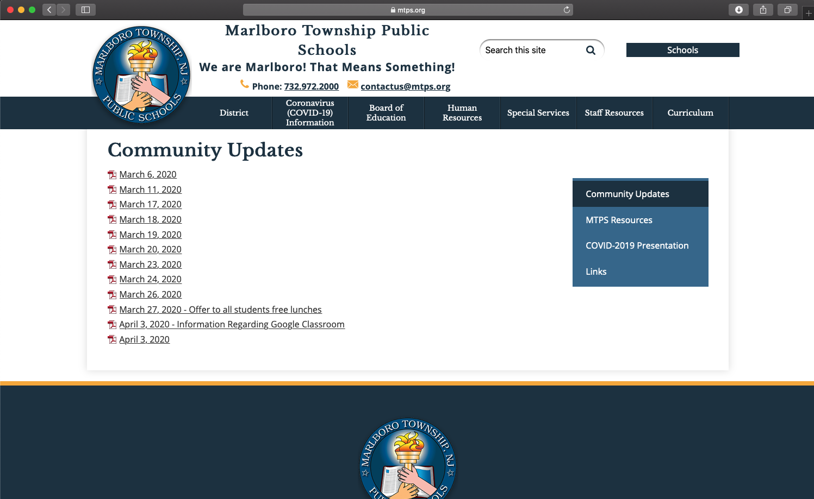 

2. Match Between the System and the Real World

This heuristic deals with the idea that the completed product should use the same language, gestures, concepts, etc. that the user is faimiliar with. That said, the system should follow the same real-world conventions such that the user does not have to guess as to what certain items on the screen mean. 

The website of choice does in fact abide by this design heuristic. When selecting an option on the top line I would expect the sub-options to be displayed below as they would be across the other platforms I’ve used in the real world. Additionally, the words are relatively clear and intuitive. For example, when I read the words “Coronavirus (COVID-19) Information” I know that just like when I watch news channels, this will include all news related to this topic.

**Severity Rating: 1/3, No Usability Issue**

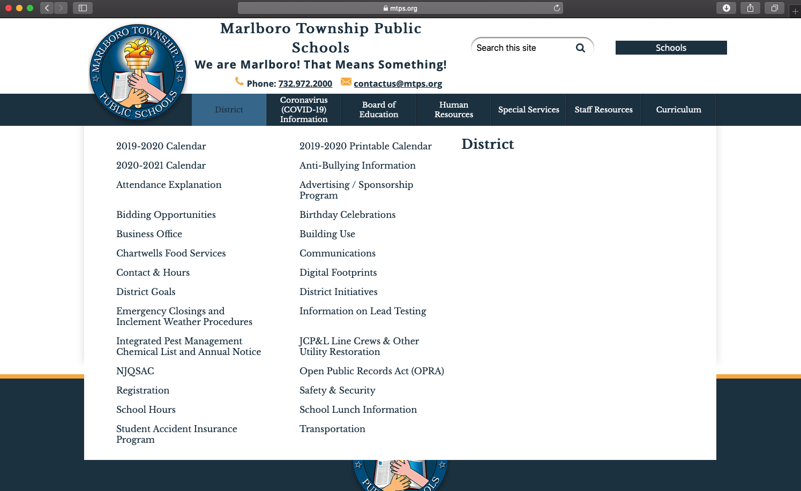 

3. User Control and Freedom

This heuristic deals with the idea that it is common for a user to choose an option by mistake and the system should offer them a way to undo or redo their selection. 

The website of choice fails miserably here and violates the heuristic of user control and freedom. When I press on the district calendar for 2019-2020 it takes me to a pdf screen with no top options bar or any method of returning to the previous page. The only way to return and undo my mistake is by using my browser’s feature. A way around this would be to embed the pdf viewer within the exsisting UI design so that users will have the appearance of being within the same system and not feel like they can not undo their action. 

**Severity Rating: 3/3, Must Be Fixed**

 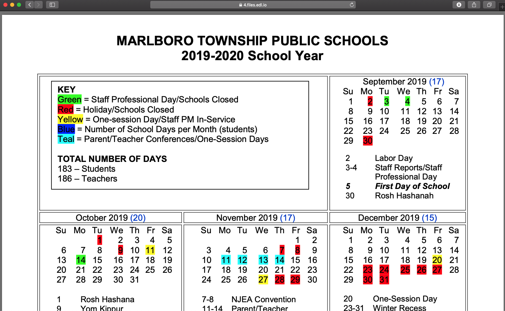 

4. Consistency and Standards

This heuristic deals with the idea that the fonts, styles, borders, sizes, etc. should all follow some consistent trend. Users shouldn’t be left guessing whether or not a different color means something different due to a lack of uniformity. 

The website of choice fails miserably in this heuristic of consistency and standards as well. When hovering over buttons nearly every single button has a different highlight color which is extremely confusing for the user. When using the website I have no idea which color represents the hover and which is just asthetic. In the screenshots below you can see a black cover for hover recognition as well as yellow and blue. Standardizing this hovering color would make it much more seamless. 

**Severity Rating: 2/3, Minor Usability Issue**

 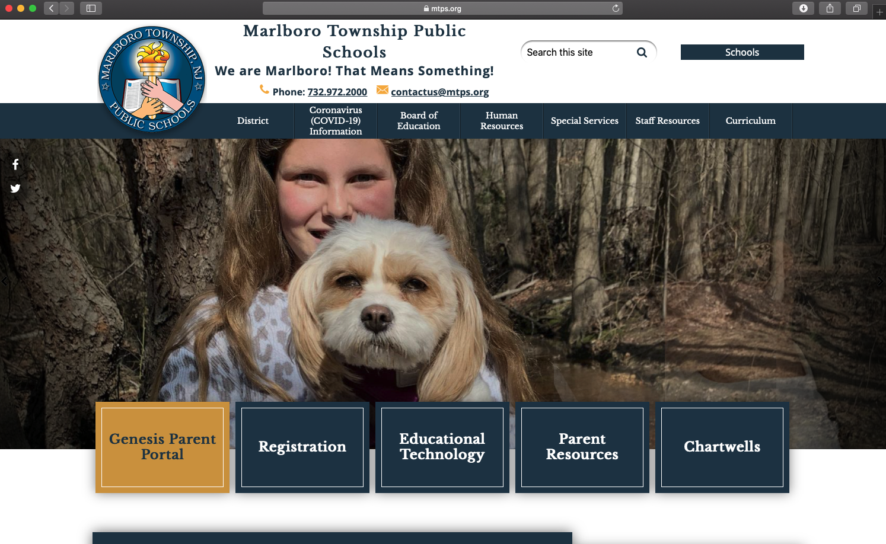 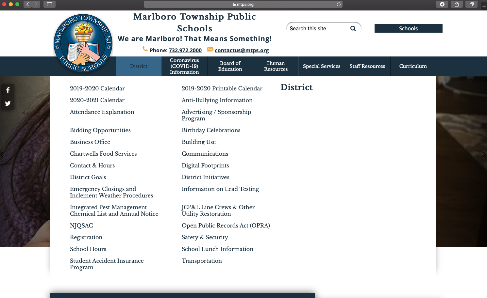 

5. Error Prevention

This heuristic deals with the idea that systems not only should have clear, concise error messages that users can understand but, great systems prevent the errors from occuring in the first place. This is typically done through a confirmation page for major actions or common mistake points and/or a check for conditions. 

The school district’s website violates this heuristic of error prevention in that it does not do a great job in preventing the user from making major mistakes. If we look at the same situation of going to the district calendar we are not given the option to confirm this selection or realize its severity. Going to the district calendar takes us completely outside the interface of the website and thus, this is considered a major action and a confirmation page should appear for the user so they could prevent doing so if desired. Instead we are directed straight to the page and unfortunately are left in a state of uncertainty. 

**Severity Rating: 2/3, Minor Usability Issue**

  

6. Recognition Rather Than Recall 

This heuristic deals with the idea that systems should minize the amount of knowledge a user needs to memorize. Users should be prompted with choices and just have to select which choices they prefer. As little memory from the user as possible is preferred for ease of use purposes.

The school district’s website violates this heuristic of favoring recognition over recall quite a few times. One of the biggest design flaws I noticed in regards to this was the fact that the main menu options were not clear enough whatsoever. If user’s wanted to access the calendar of events they would have to previously have memorized the fact that this falls under the “district” option instead of perhaps a much clearer option such as Schedule. 

**Severity Rating: 3/3, Must Be Fixed**

 

7. Flexibility and Efficiency of Use

This heuristic deals with the idea that great systems should allow for experienced users to move ahead via shortcuts called accelerators. Advanced users should not have to take the rudimentary route of completing actions as someone who was using the application for the first time. 

This website does not fair well at all in terms of flexibility and efficiency of use and violates this heuristic. If you were an experienced user and wanted to quickly sign-in to your account you would have to manually scroll all the way to the bottom of the page and find the link to do so as pictured below. Instead, there should be an extremely visible accelerator at the top right or left corner of the screen so experienced users do not have to do any navigating for use. This would also not slow down first time users whatsoever. 

**Severity Rating: 3/3, Must Be Fixed**

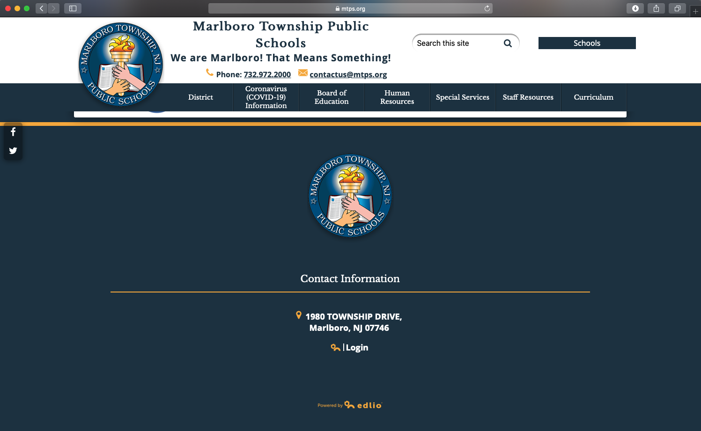 

8. Aesthetic and Minimalist Design 

This heuristic deals with the idea that information conveyed on the screen should as direct as possible. Anything extra is distracting to the user. 

The website of choosing once again violates this crucial design heuristic of minimalist design. The website is absolutely flooded with options to choose from with what seems like no consolidation whatsoever. For example, under the district heading there are three different suboptions with a calendar reference. It would be so much easier and more visually appealing if there were to just be one calendar option and then have users select from there. Instead these all appear at the same time and clutter the screen as shown. 

**Severity Rating: 3/3, Must Be Fixed**

 

9. Help Users Recognize, Diagnose, and Recover From Errors

This heuristic deals with the idea that error messages should be expressed in plain language without any sort of abstract computer code. Users should be able to understand the mistake they made clearly so they can easily correct it. Great systems will also propose a solution on the spot. 

The school district’s website does in fact abide by the heuristic of allowing users to easily recognize, diagnose, and recover from their errors. When attempting to login to a student’s account if their login credentials are incorrect there is a very clear error message displayed at the top of the screen stating the user has entered an incorrect password and/or email. This is done well as it tells the user almost exactly what to fix in order to succeed in their use. 

**Severity Rating: 1/3, No Usability Issue**

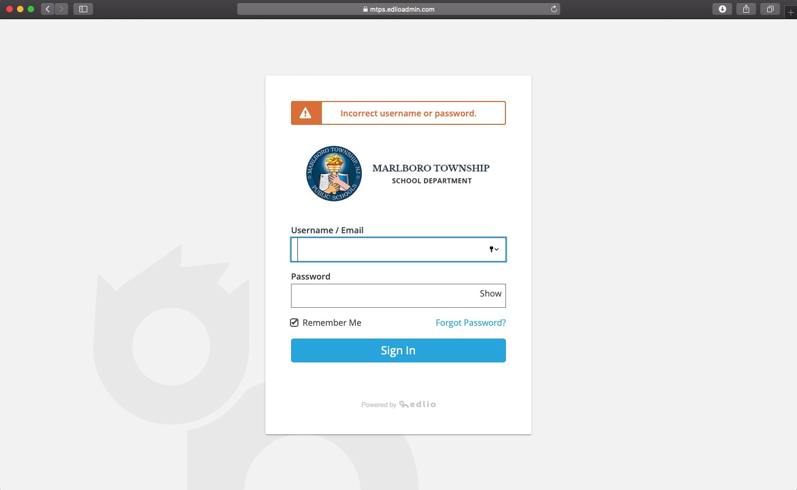 

10. Help and Documentation

This heuristic deals with the idea that it is sometimes necesarry to offer help and documentation to users so they know how to use the system in the event they are confused. This instructional information should be extremely clear, concise, and easy to navigate such that users do not have to read the entire documentation. 

The school district’s website violates this heuristic of help and documentation. While it is not as severe as some of the other design heuristic violates mentioned previously since there is in fact a search bar the top of the screen, there is still a clear violation. There is not searchable help button or even an easy FAQ list. This should for sure be an added option to the unorganized, cluttered heading bar. 

**Severity Rating: 3/3, Must Be Fixed**

 

## Heuristic Evaluation #2 - Marlboro Township Public School District Website 

OVERVIEW 

Being someone that is deeply invested and convinced of the value of young learning and in particular virtual learning, I appreciate the importance and need for a great school district website. After taking a look into my hometown's website I wanted to do a similar investigation into the school district of my current home, Los Angeles, CA. Thus, for my second heuristic evaluation I chose to do yet another thorough analysis of a public school district website and arrived on the Los Angeles Unified School District website. 

OVERALL EVALUATION

Upon reviewing this website I found a lot of similarities to the previous in terms of areas of user experience design that it lacks any attention to. Most notably, the minimalist design has seemingly been thrown out of the window as the landing pages are downright distracting and confusing to the user who is on a quest for knowledge. However, there were certainly some areas that this website shines in related to design that the Marlboro website completely lacked such as accelerators for experienced users and help/documentation. All in all, the website is for sure in need of an overhaul. 

SCREENSHOTS OF USER INTERFACE AND DIRECT LINK

https://achieve.lausd.net/domain/4

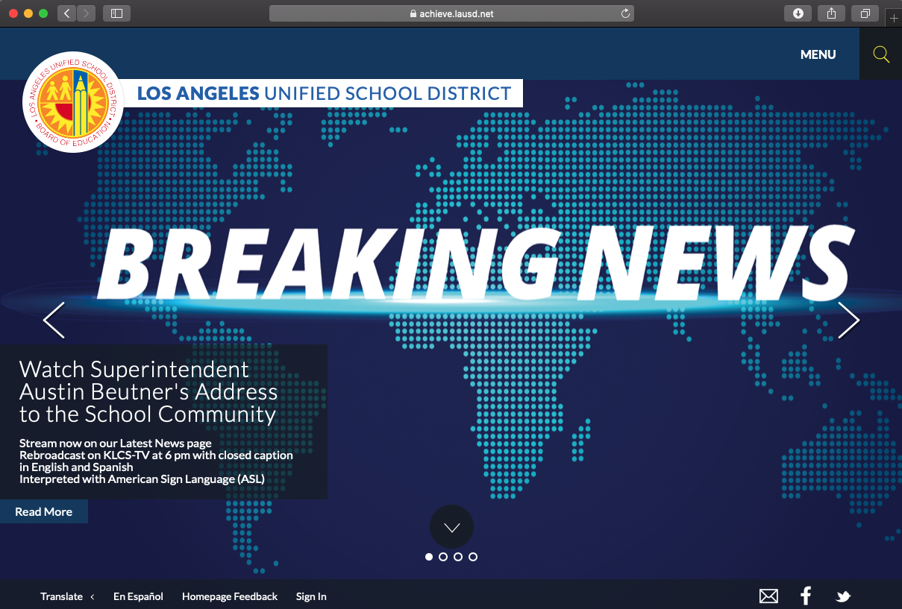 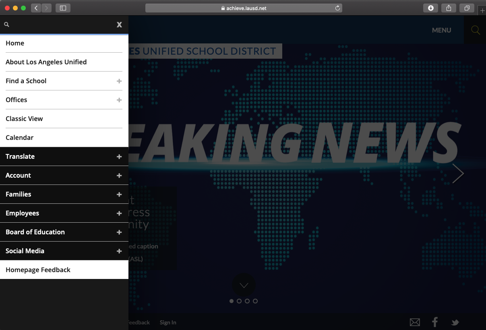 
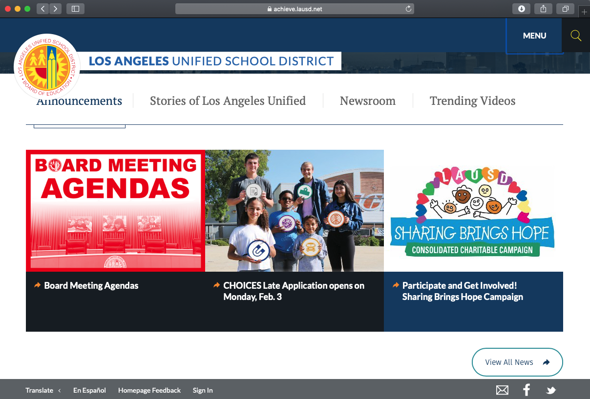 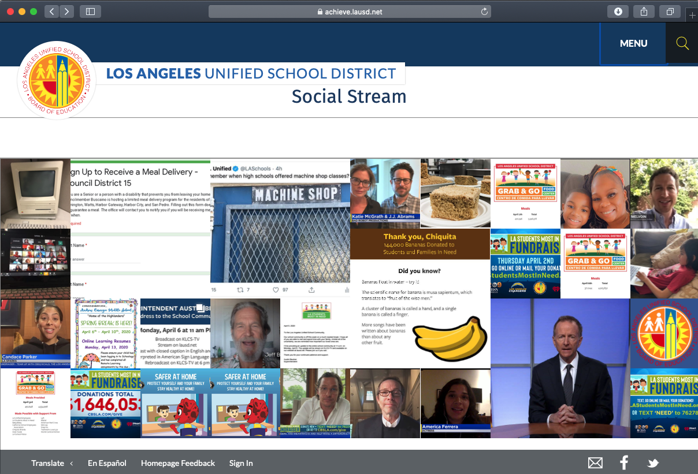

1. Visibility of System Status

The LAUSD website does in fact violate this UX design heuristic of visibility of system status. This heuristic entails that users are show exactly where they are in the system at any given point and can easily navigate between the site map. When using the website no matter which sub-page you are on, the menu options look the exact same with none of them highlighted. Thus, here in the screenshot I am on the Calendar tab but, in the menu options you can not tell this whatsoever. In order to fix this easily one might just designated a highlight color for the user's current tab/location.

**Severity Rating: 3/3, Must Be Fixed**

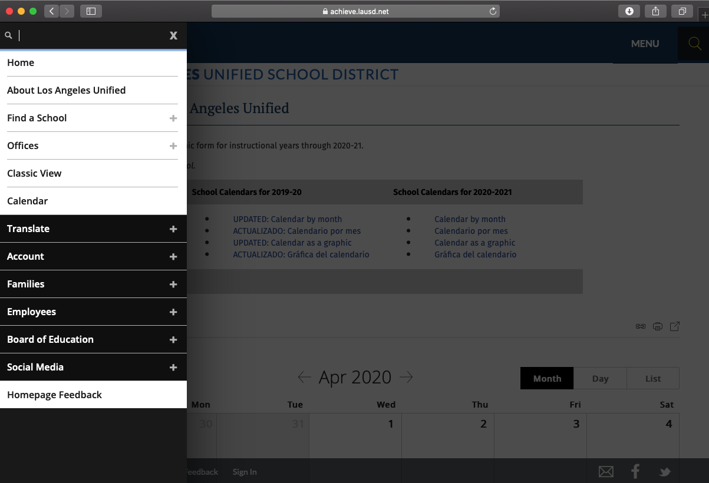 

2. Match Between the System and the Real World 

This design heuristic tells us that good design is a design who uses/speaks the same language as the user is use to. Here, the LAUSD actually does a great job to do just that by making the menu options as intuitive as possible. Users for certain know what "Find a School" entails and the same is true for "Calendar" and "Employees". Thus, this is actually an example of this heuristic being well done. 

**Severity Rating: 1/3, No Usability Issue**

 

3. User Control and Freedom

This heuristic is the idea that great systems are designed with user mistakes in mind. It is frequent that users, especially inexperienced ones will inevitably click an incorrect button and navigate to the wrong page. As a result it is crucical to offer users and undo/redo option. LAUSD fails to do so here and I am forced to use my browsers back button. There is no site map tree at the top where I can easily undo my action here of navigating to the directory page. To fix this there should be a site map tree at the top of navigation buttons. 

**Severity Rating: 2/3, Minor Usability Issue**

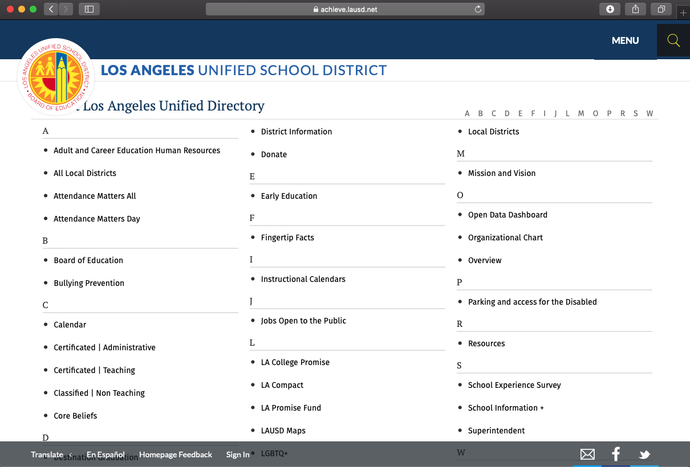 

4. Consistency and Standards

This design heuristic here deals with the idea that great design does not leave the user guessing in its conventions. The system uses uniform fonts, inductor messages, sizes, etc. The LAUSD website does not abide by this heuristic as seen through what's quickly becoming their infamous menu bar. The menu bar here has half the options listed with a black background and half the options listed with a white background. As a user I am left guessing as to why this is? To fix this the options should just be made all the same color. 

**Severity Rating: 3/3, Must Be Fixed**

 

5. Error Prevention

This design heuristic is the idea that great systems are designed to prevent the user from making a potentially catastrophic mistake and thus, are designed frequently with confirmation pages asking the user to confirm a major selection. The LAUSD website violates this design heuristic as it brings outside of the main interface when going to the option of "find a school" and it doesn't ask me to confirm that selection eventhough its effectively a death sentence. To fix this there must be a confirmation button added to ensure the user wanted to proceed. 

**Severity Rating: 3/3, Must Be Fixed**

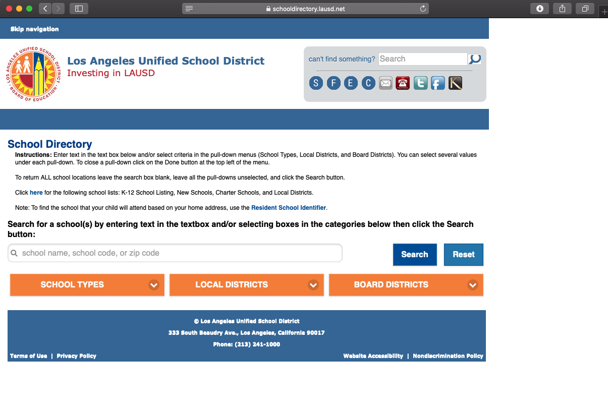 

6. Recognition Rather Than Recall 

This heuristic outlines the fact that systems should make the amount of knowledge a user needs to memorize as small as possible. Users should be prompted with choices and just have to select which choices they prefer. The LAUSD website actually does abide by this design principle as all of the options are pretty clearly displayed on the screen. For example in the screenshot below users would not need to remember that they wanted to go to the district's social media pages since the options are offered to them without asking in the lower right hand corner. 

**Severity Rating: 1/3, No Usability Issue**

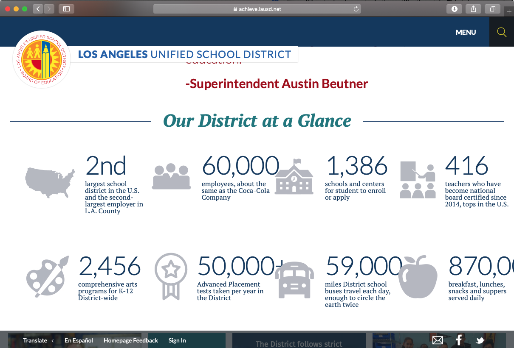 

7. Flexibility and Efficiency of Use

This design heuristic has to deal with the idea that accelerators are necessary to give more advanced users the opportunity to move through the software quicker without hindering the experience of first time users. A great example is displayed on the district's homepage of a permamanet "Sign In" button something the Marlboro NJ district lacked. Having this here allows those with accounts to access them quickly without taking away from the first time user's experience. 

**Severity Rating: 1/3, No Usability Issue**

 

8. Aesthetic and Minimalist Design 

This heuristic deals with the idea that information conveyed on the screen should as direct as possible. Anything extra is distracting to the user. The LAUSD website actually doesn't do such a great job with this as they went overboard. The designers interpreted this to mean having no options whatsoever on the homescreen and instead a large photo. This is great and all except for the fact that a determined user won't care about the photo and will want options right away. To fix this, there should be basic options display toward the top of the UI. 

**Severity Rating: 2/3, Minor Usability Issue**

9. Help Users, Recognize, Diagnose, and Recover From Errors

This design heuristic has to do with the fact that users should be shown clear error messages when they make a mistake so that they can recover quickly and keep moving. Ths LAUSD website succeeds in offering this to its users on its sign-in page similar to the Marlboro, NJ page by telling users if their password or email is incorrect which is crucial for a user's understadning of how to proceed further. 

**Severity Rating: 1/3, No Usability Issue**

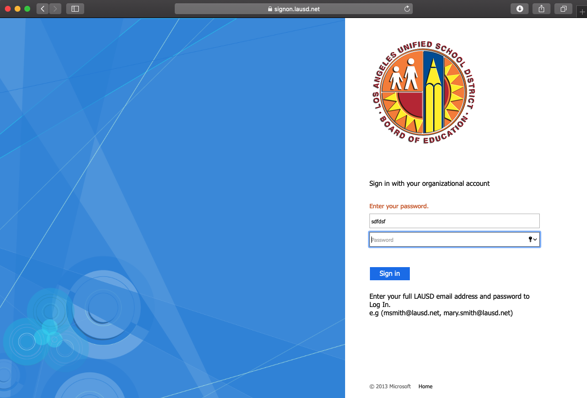 

10. Help and Documentation 

This design heuristic has to do with the fact that users should be given the option to recieve clear, precise, and effective help when they are unsure of what to do. The LAUSD website understands this and actually offers a feedback option on the main page so users can reach out for help as well as offering an option to submit an email for help. 

**Severity Rating: 1/3, No Usability Issue**

