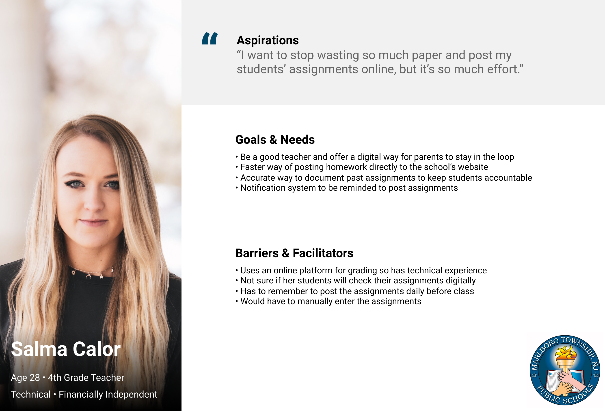
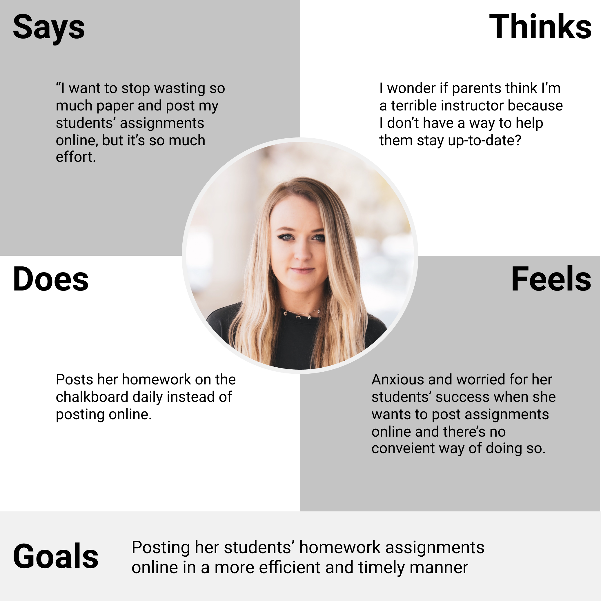
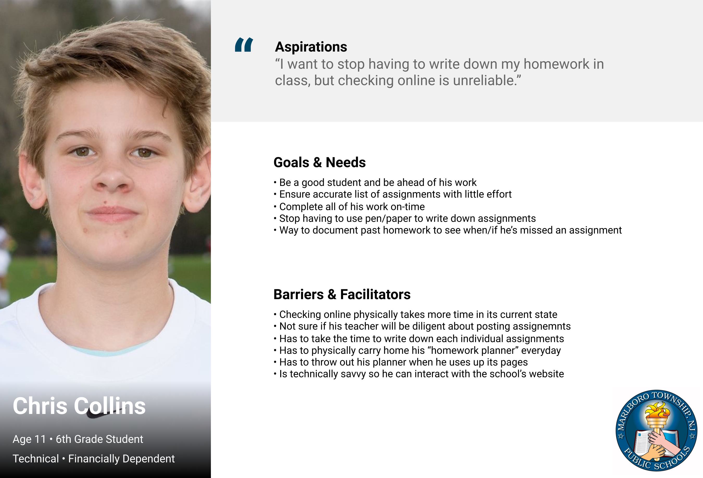
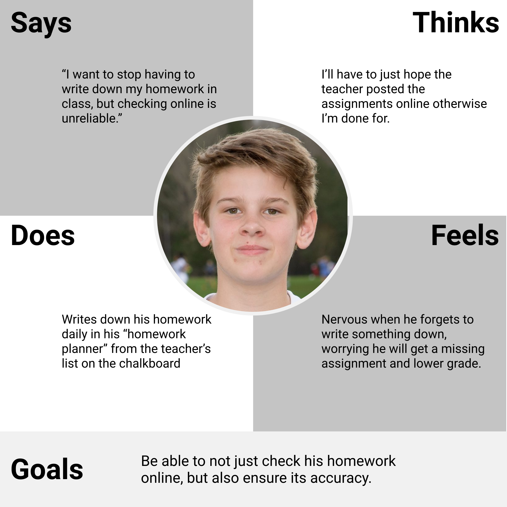
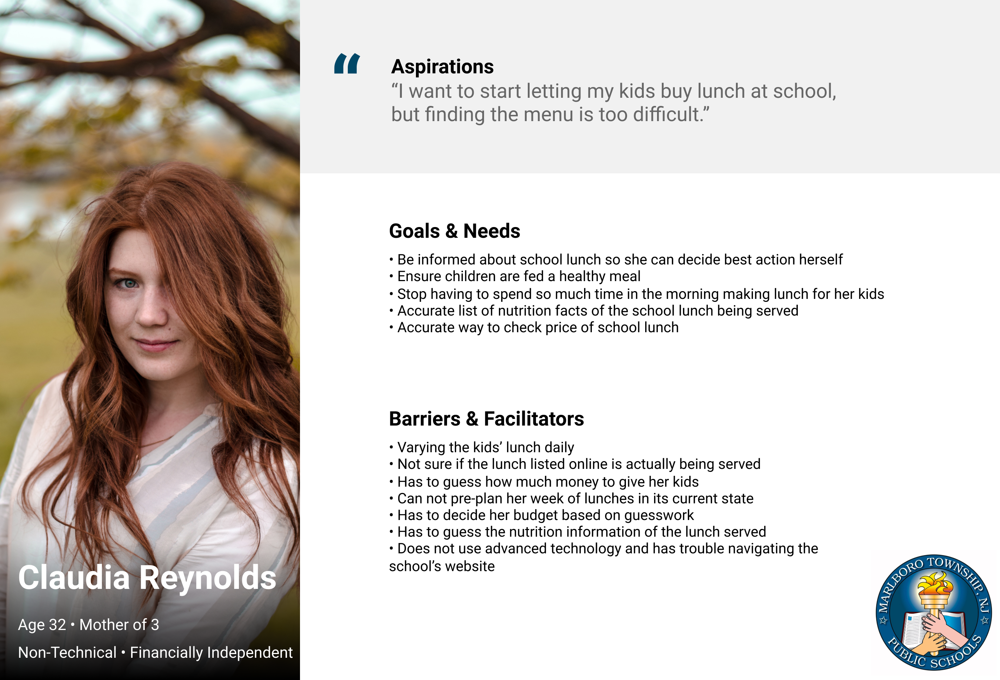
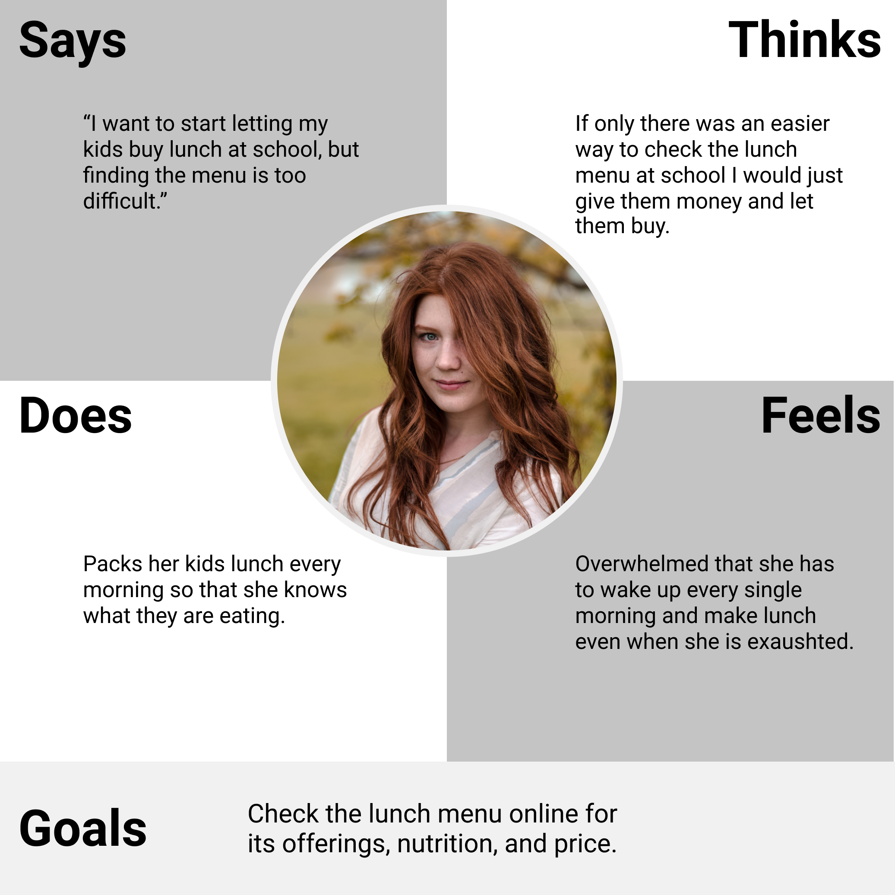

# DH150 - Assignment 05 - Presona + Scenarios

Nathaniel "Asher" Kraut

## Introduction:

Every great product is built especially for its users. Without understanding the potential product's users, it is nearly impossible to actually create value in their lives. UX storytelling is the art form that addresses this very idea. Through UX storytelling we can contextualize users, understand their specific needs, and move closer toward a solution not just for one target demographic that we may have previously planned, but all the unplanned user paths as well. Through creating these personas and empathy maps, I took yet another major step in my path toward becoming a great UX designer. Becoming a critical listener and being able to regurgitate things as simple as a user's goals, mindset, and ambitions is a lot harder than it sounds and I am greatful to now fully understand the importance of continuing to become a better UX storyteller. This skill is applicable not just to product design, but everything life. If you can understand how and why people feel the ways they do, you can understand how to alter or remedy those feelings, which is incredibly valuable.

## Three Features I Want to Design:

1. Certainly the first feature I want to (re)design is the homework calendar on the students' online portals. Redesigning this feature correctly will completely eliminate the need for students to write down homework in-class daily saving time, paper, and energy. 

2. Next, I am going to (re)design the school lunch menu interface entirely. Currently, the school lunch menus are nested within multiple vague dropdown menus and helping to improve the site's navigability via this (re)design will be instrumental in giving parents and students both the clarity they deserve and demand when evaluating the lunch options. 

3. Lastly, while having a (re)designed student homework portal will be great, it will only be as valuable as the information that is posted to it by the teacher. In an effort to increase the reliability of this calendar I plan to implement a daily teacher notification system that will remind teachers that their students are counting on them to post this information promptly. 

## Personas and Empathy Maps:

**Salma Calor**

  

**Chris Collins**

  

**Claudia Reynolds**

  

## Scenario and Journey Maps:

**Salma Calor's Scenario**

Salma is a 4th grade teacher in the Marlboro Township Public School District in Marlboro, NJ. She’s only two years into her young career and is very technically savvy, having used a lot of digital learning programs throughout her career as a student. Back then, she honestly never knew she was coming to become a teacher and so she paid little attention to which features would be helpful in her career later on but still has an understanding for the constant communication that is needed between students and their instructors. She desperately wants a way to bridge this gap between her students, their parents, and herself. One area in particular that she's rather keen on figuring out a solution to is the dilemma of homework transparency. As it currently stands, the online platform for posting homework is too outdated and obsolete, extending what should be a very simple task into a tiresome one. As a result, Salma has had no choice but to forgo doing that and instead post her homework every morning on the in-class chalkboard. Additionally, not only would Salma have to get through the lengthy process of posting her homework, she'd also has to remember it in the first place, something she feels particularly anxious about. What if there's a lot of things going on and she simply forgets, then her students are in a pickle. 

In a perfect world, Salma's mobile device sends her a notification every morning, ten minutes before her students arrive urging her to upload the homework of the day to her teacher portal. After receiving the notification, she navigates to the school district's website and signs into her teacher account. Once inside the portal she sees two potential routes she can navigate through. The first is the pop-up window that greets her and tells her to post the homework. This pop-up window includes a directly linked button that will take her straight to the upload screen. At this upload screen she can either upload a document such as a pdf or she can input text right into the on-screen textbox. She can then simply press upload and this will automatically push it to all of her students' calendars in their respective student portals. If Salma were to accidentally close the pop-up window all she has to do is see the options menu on the left-hand side of the screen and select "homework calendar". Once doing so, she will be brought to the same screen that the pop-up window brought her to. With this redesigned interface, Salma can rest easy knowing both herself and her students will be able to see the homework assignments in real-time from any location. She feels relieved knowing that her prayers have been answered and the endless phone calls from her students' parents will stop. 

**Chris Collin's Scenario**

Chris is a 6th grade student in the Marlboro Township Public School District in Marlboro, NJ. As Chris has just entered middle school, he has been putting increasing amounts of pressure on himself to do better in school. This comes as a direct result of his parents breathing down his neck when he gets off the bus at the end of the day. When Chris was in elementary school, if he forgot to do his homework one day it was all fun and games, there was truly no consequences. However, as Chris is growing older and this pressure to succeed is increasing, his needs have changed quite a bit. Chris is also very forgetful and so this forgetting of homework is a rather recurring episode unfortauntely. Whenever this happens, his first instinct, being someone born into the technological age, is to check his student portal to see the homework calendar. When doing so, Chris is angered to see that the homework calendar hasn't been updated in weeks and the assignments that are listed don't have all the information he was given in-class. This has led to several missed assignments and poor grades on his work, to which his parents have not been pleased with. Chris needs a better way to ensure the accuracy of this calendar so that he can stop having write down every piece of every assignment in-class with a pen and paper.

In a perfect world, after his teacher has posted the homework for the day, Chris will receive a notification to either his mobile device or email telling him the homework of the day has been posted. Since the teacher was notified first thing in the morning she knows to habitually login to her portal and provide all the details necesarry for her students success. Similar to how the pop-up window shows for teachers needing to enter homework, when Chris navigates to the school website and signs into his account, he will be greeted with a pop-up window that has a button linking him directly to his homework of the day. When clinking into the button and arriving at the day's homework calendar, there's also a button he can press there to "ask for help". Hitting this button will allow Chris the opportunity to ask for clarification on the assignment or just get general help. Chris now feels much less stressed knowing that he can save paper, time, and energy by just simply checking his student portal and seeing all of his assignments. Chris receives less scolding from his parents now as well and all are happy. 

**Claudia Reynold's Scenario**

