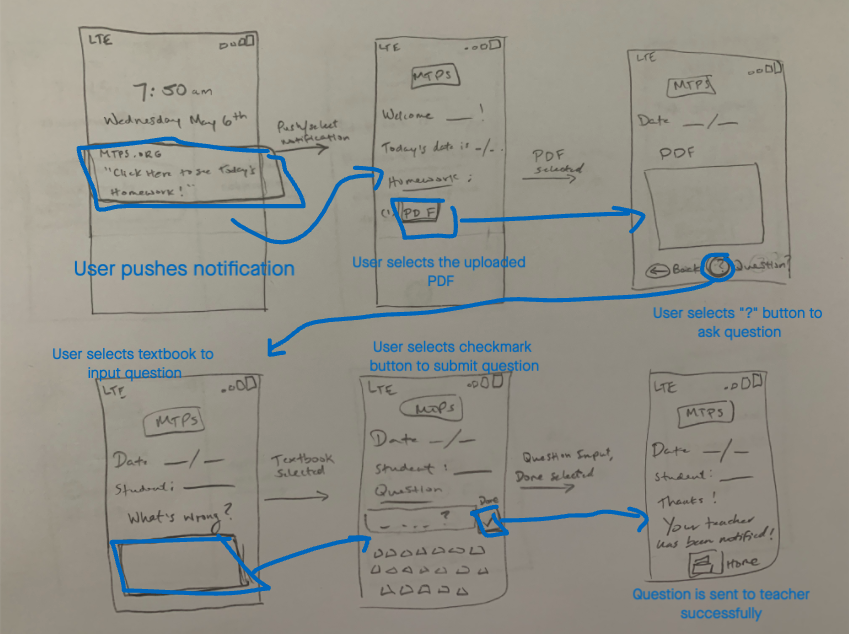

# DH150 - Assignment 06 - Low Fidelity Prototype

Nathaniel "Asher" Kraut

## Introduction:

>The world is unpredictable to say the least: we can hope for the best, but at the end of the day nature is out of our control. In late 2019, we saw the outbreak of a global pandemic and collectively we were not ready. As a result of the spread of COVID-19, society has been forced to pivot virtual. We've seen entire corporations tell their employees to work from home indefinitely using slack, zoom, and several other communication tools. Additionally, we've seen schools around the world, UCLA included, move all classes online, with great uncertainty as to what the future holds. That said, it's clear that there is a need now more than ever for improved education technology in order to facilitate this transition. At the start of the quarter having this in mind I chose to center my design project around redesigning a public school district website that I used growing up in my hometown of Marlboro, NJ. The website serves as a platform for students, teachers, parents, and administrators to collectively collaborate online to monitor students' learning progress. The website is meant to feature school lunch menus, homework calendars, and so much more. 

>Through user research, I found that the school district's website is not as effective as it could be in its ability to extend the physical classroom online. One of the biggest areas for improvement that users identified was the website's homework calendar. Not only is the calendar hard to navigate to, but in addition uploading to the calendar for teachers takes much too long even for the most technology savy of users. One of the users I interviewed was a young 4th grade teacher who had used online education tools in her school days yet still had trouble uploading for her students and their parents to see the homework of the week. On the other end of this problem, I was hearing consistently that students were having a tough time using the calendar as it currently stands because there is a reliability issue. Essentially, because the platform is difficult for teachers to upload, they don't. When the teachers don't upload the assignments, students struggle to keep up with monitoring what is expected of them, creating a lose lose situation for all. 

>After drawing conclusions on my user research, I created three different personas to simulate user scenarios. I was keen on focusing on all perspectives of this information/navigation problem: teachers, students, and parents. At the end of the day, parents just want to be kept in the loop on what is going on in school, teachers want to provide as much knowledge to their students as they can, and students want to learn as much as they can. That said, I created the three personas with this in mind: Salma Calor, Chris Collins, and Claudia Reynolds. Salma Calor is a 28 year-old 4th grade teacher who wants an easier way to post homework assignments of the week. Chris Collins is a 6th grade students who needs a better way to ensure the accuracy of the online calendar. Claudia Reynolds is a 32 year-old mother of 3 and wants a better way to check on the lunch menus that doesn't just say what's being served, but also gives pricing and nutrition information. 

>As a result of these three personas, I elected to redesign the following three unique usage scenarios, although slightly interconnected at the same time:

>1. Design a notification system that alerts teachers to upload homework every morning on a recurring basis via a mobile device push notification. Additionally, I have redesigned the UI of the upload screen to ensure it is as friction-less as possible. 
>2. Design a notification system for students that alerts them when their teachers have published the day's homework, to ensure they are seeing the most up to date information. 
>3. Add nutrition information to the daily lunch menu as well as pricing information. 

## Wireframes and User Flows

1. Teacher notification system for uploading homework 

>In the wireframes below I sketched the user journey a teacher would take when receiving a push notification to upload her homework in the morning. Note that the beinning of the flow assumes the user receives a push notification at 7:45am daily saying "Click here to upload the homework of the day!"

Wireframes

User Journey 

1. Push the notification that says "Click here to upload the homework of the day!"
2. Select upload button
3. Select PDF button in the type of upload section
4. Select upload button
5. Select desired file from device
6. Homework uploaded successfully

2. Student notification system for homework viewing

>In the wireframes below I sketched the user journey a student would take when receiving a push notification to their mobile device that informs them their teacher has uploaded the day's homework. Similar to the teacher's user journey, this flow assumes that the student clicks into the notification when received. 

Wireframes 

User Journey

1. Push the notification that says "Click here to see today's homework!"
2. Select the pdf button under the homework section
3. Select the question mark button to ask a question while viewing the pdf
4. Select the textbook on the question screen to begin typing 
5. Input the question and select the checkmark button when done 
6. Teacher notified of question

2. Redesigned lunch menu for parents

>In the wireframes below I sketched the user journey that a curious parent might take if they wanted to stay informed about what is being served for lunch and its subsequent nutrition and pricing information. 

Wireframes 

User Journey

1. Select the MTPS mobile application 
2. Select the lunch button on the bottom of the section
3. Select "pizza" under today's lunch date
4. View pizza information and select back when done viewing 
5. Select "panini" under tomorrow's lunch date
6. View panini information 

## User Testing and Iteration

>After drawing some basic wireframes for the individual use cases, I asked hypothetical users to complete the three tasks that the wireframes were designed specifically for. 

> 1. Upload the homework for the day after receiving a push notification. 
>2. Check the day's homework after receiving a push notification and ask a clarifying question.  
>3. View nutrition information on the daily lunch menu as well as pricing information. 

User Walkthroughs

>Below outlines the unique user journeys that the test users acted out in practice which actually gave me some practical insight on how real users might interact with my flows. 

1. Upload the homework for the day after receiving a push notification.

In the teacher use case here, their intial thought was to check to see if they could change the date of upload to perhaps upload in advance of a future date but, were not able to. After failing in this attempt they proceeded to upload a PDF document for their homework of the day and successfully did so but requested a future feature to allow users to upload multiple PDF documents instead of just one. 

2. Check the day's homework after receiving a push notification and ask a clarifying question.

In the student use case here, the tester requested the option to see any day's homework that they might desire whereas the flow was only designed to show the one specific day's assignments. That aside, the user navigated the flow with ease, without requiring help. 

3. View nutrition information on the daily lunch menu as well as pricing information. 

In the parent use case here, the tester identified some pretty glaring UX mistakes that I made when designing my flow, mostly centered around the intuitiveness of buttons and their respective locations. Ultimately though, once guided slightly the user did in fact successfully navigate through the flow easily. 

## Reflection

>As a designer who loves to focus on the UI features of mobile/web applications, designing low fidelity prototypes is not my forte to say the least. Having the opportunity to do sin this exercise here was a very valuable piece to add to my design education. I have a renewed understanding for how critical these early stages are in design and more importantly how time saving they can be. In the example of my teacher use case where the test user pointed out some "wrong" button locations, I was able to get that feedback and notice that a change was needed before having to design and develop any further high fidelity prototypes in a tool/environment such as Figma or xCode which is incredibly helpful. Additionally, completeling this activity showed me that just like when user researching, it is important to not interject any sort of guidance and let the users truly play with the flow on their own. At times I wanted to tell the user what to do nad resisted the urge such to get more meaningful feedback eventhough this was difficult in practice as users sometimes will ask for help when they are stuck. 

>Overall, I was hoping for a more seamless experience with allowing hypothetical users to test my product however, as stated above I realized that is a lot more difficult in practice. In the future, I will hope to hand the low fidelity mockups off to someone else to test users as my personal bias got in the way of acquiring some valueable feedback. Additionally, I think having these low fidelity mockup screens on a prototype tool such as figma where users can click through the journey is a lot more valuable than having them drawn out on paper, despite the obvious speed advantages to be gained by hand drawing them. All in all, I learned a lot from this activity nad I have a lot of actionable insight to take with my into next week's high fidelity protoptye activity. 
