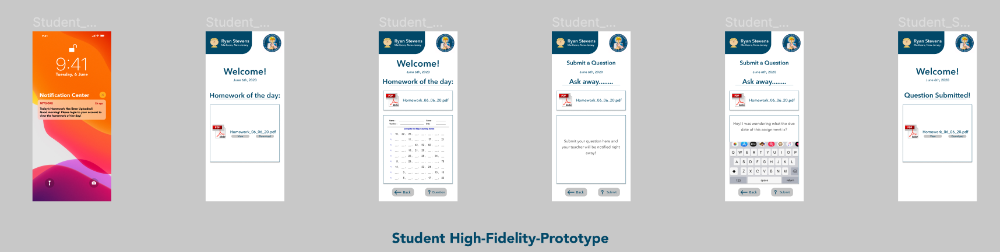

# High-Fidelity-Prototype : Marlboro Township Public School District Mobile Application

### DH150 Assignment07: High Fidelity Prototype by Nathaniel "Asher" Kraut

- Figma Prototype Preview: https://www.figma.com/proto/tCBKyCYAGDMZtkGquJAWFj/N_Asher_Kraut_Assignment_07?node-id=1%3A2&viewport=241%2C117%2C0.09119778126478195&scaling=scale-down

- Prototype Wireflow URL: https://www.figma.com/file/tCBKyCYAGDMZtkGquJAWFj/N_Asher_Kraut_Assignment_07?node-id=0%3A1

- User Testing Video: https://drive.google.com/file/d/1n5zh8L44Fhu1NYfpg_4_x0VEEx8YgMHB/view?usp=sharing

## Description of Project

>This quarter I chose to redesign the Marlboro Township Public School district digital education platform. The platform is used by parents, students, teachers, and administrators to reinforce the typical classroom setting. When I first began this project times were considerably different than they are now. It is no longer a luxury to have a great online education platform for schools. Instead, with COVID-19 and the racial tensions reaching new heights in the United States, a safe digital learning environment is essential. 

>That said, this redesign involved getting inside the minds of multiple different users and their unique needs. Instead of redesigning a platform that has the same, or very similar, interface for all its users, this platform proved quite different. Thus, as you will see below in my high-fidelity prototypes, there are three different user journeys/flows I chose to focus on. In my research I found that teachers needed a more efficient way to upload homework for their students and their parents to view and on the flip side, students needed a better way to view their homework. Additionally, I heard complaints time and time again from parents who wanted to send their kids to school with lunch money to purchase lunch and lighten their burden, but checking the menu as its currently done was simply too much of a hassle. 

>In summation, after all was said and done I knew something could be done to improve this user experience ten fold and thus, below is my interpretation of how to make life easier for the users of this platform. The purpose of this assignment in particular is to add flair/complexity to the already exsisting low-fidelity wireframes I made in the previous assignment. When pivoting these to high-fidelity prototypes I was able to add life to my drawings if you will and truly start to gain an understanding for what my visions would look like if fully developed. This allowed me to collect improved user feedback as no more are my testers looking at blank screens but instead there's exciting fonts, colorways, buttons, and more. Ultimately, as a product designer the goal in mind should always include the question of how can we get the most quality user feedback possible in the shortest amount of time. The answer is certainly high fidelity prototypes and I am happy to have produced these and learned quite a bit more. 😊 

## Interface Design

>Choosing color schemes, button formats, sizes, fonts, etc. is fundamental to any function UX, expecially for mobile applications. We'd be lying to say that the user experience is not fundamentally rooted in the user interface (UI) design. If the buttons aren't fun to interact with, why would the user do so? Additionally, if the text isn't legible how could a user possibly interact with the application? That said, I used extreme caution when deciding which color scheme to go with and ultimately decided to not stray far from the exsisting: navy blue, grey, white, black. I used white backgrounds in order to make the text on every screen pop, as well as navy blue containers to ensure users eyes' were directed subconsciously to what they needed to see. Moreover, I choose to go with the a very playful design as the primary users of this platform all still students none the less and they want a fun experience plain and simple. To play on this, I implemented rounded corner buttons giving a more flexible feel as well as bitmoji-like avatars for user photos to dim down the seriousness level. Below, you'll find my various high-fidelity wireframes for all the different user paths: teachers, students, and parents!

### Teacher User Interface 

>Below you will find the user interface for my teacher user journey. In this path, a teacher is alerted to post her homework before teaching in the morning and within just a few clicks she has the option to choose whether to upload a PDF document, text, or even an image straight to the cloud. In this journey, I emphasized convenience, speed, and minimalism, as evidenced by the simple color flows and clearly worded buttons. 

### Student User Interface 

>Below you will find the user interface for my student user journey. This path is slightly different from the teacher flow but has its similarities for sure. Again, based on my UX research I found that undoubtedly speed is the most important aspect for students when checking their homework. Simply put, if it is not easy to do, they simply just don't do it so I know I needed to make their journey as quick and intuitive as possible. As a result, I implemented most of the same logic as I did for my teacher journey and stuck with simple colors, bold text, and white foregrounds. 

### Parent User Interface 

>Lastly, below you'll find my user interface for my parent user journey. In my research I actually found a different need from parents than students/teachers. Unsurprisingly so, parents focus primarily on the content! They want to see everything and anything they can, in a friednly manner. That said, I took this to heart nad made sure to display the entire nutrition facts for the lunch menu on their own pages as well as photos of the food and corresponding prices. Instead of keeping the pages as decluttered as possible I found the happy medium between stacks of information and intuitive, minimalist user interface design. 

## Impression Test and Cognitive Walkthrough

>It's always tough to hear stylish comments that you don't want to hear but that doesn't mean that we shouldn't pay them any attention! In my impression test the results were largely positive outside from "personal perference" UI design related comments, as referred to by the user. It was clear what the application's purpose was from the start and they even referred to its design as fun - which was awesome to hear since this was my intended feel! They suggested perhaps changing my button design from rectangles to circles to make them more intuitive but outside of that the first impressions were great and exactly what I wanted to hear. 

>For my cognitive walkthrough, since my tester was a parent of a middle school student I asked them to walk through the parent user journey designed where they can check the lunch menu and find out more information about the offerings such as price and nutrition information. In the end, the participant easily completed the task outside of a few simple mistakes that they quickly recovered from without assistance. Once again when moving through the application the user voiced their desire for more differentiaton visually between titles, buttons, and body texts, but outside of that they were extremely pleased with the functionality of the application. 

>[Here](https://docs.google.com/document/d/14Al9QeMn8BIlgOpYR2JmVJOneJzBFDcArdEqcYhcljw/edit?usp=sharing) is a link to my findings. 

## Accessibility Check

>The beauty of Figma is certainly its versatility for designers in the integrations and plug-ins it offers. One of these plug-ins is "Spark" which allows you to perform color contract tests to ensure you have designed with the optimal color schemes and users in mind. I ran color contrast tests for several different texts in my designs and attached the results below. 

## Interactive Prototype

>The interactive prototype for my teacher user journey is located [Here](https://www.figma.com/proto/tCBKyCYAGDMZtkGquJAWFj/N_Asher_Kraut_Assignment_07?node-id=1%3A2&viewport=490%2C296%2C0.1888895481824875&scaling=scale-down). 

>Please note that if you are interested in viewing the prototypes for the other user journeys you can do so by accessing my entire Figma design board [Here](https://www.figma.com/file/tCBKyCYAGDMZtkGquJAWFj/N_Asher_Kraut_Assignment_07?node-id=0%3A1) and selecting the first frame of the respective journeys and then activating the prototype. I realy wanted to include all the separate links here, but unfortunately Figma does not provide me with this luxury. 

I've also gone ahead and detailed the user flows that have prototyped for here below such to avoid any guessing games for my testers. 

Teacher User Journey:

1. Select the notification to begin
2. Select the upload button to begin the homework upload process
3. Select PDF button to upload a PDF document 
4. Select the homework PDF document from your files
5. Cancel the upload by pressing the cancel button underneath the file name or use the back button to go backwards 

Student User Journey:

1. Select the notification to begin
2. Select the view button underneath the PDF document that's been uploaded for the day
3. Select the question button to ask the teacher a question about the homework 
4. Select the empty text box to type your question
5. Press the submit button to submit your question to the teacher
6. The back buttons also work for navigational purposes

Teacher User Journey:

1. Select the notification to begin
2. Select the lunch option on the home screen
3. Select the pizza option to see the nutrition and pricing information for the pizza
4. Select the back button for navigational purposes
5. Select the hot dogs option to see the nutrition and pricing information for the hot dogs

## Diagram

>The screenshots below outline the high-fidelity prototypes with the actual navigation nodes present so you can see which screens and buttons lead to which buttons. I've gone ahead and separated these out into the three user journeys since they are all separate interactions and do not connect whatsoever - aside from the fact that teachers must upload homework before it is visible in the student portal. 

